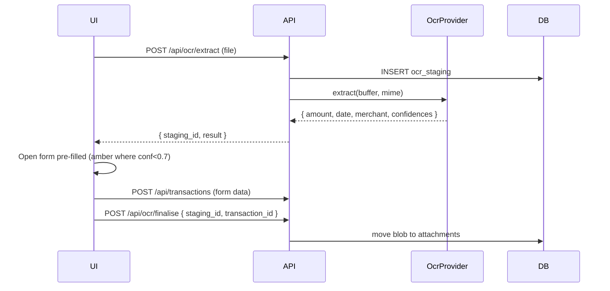

# OCR / Receipt Auto-Fill on Attachment Upload

## Summary

Receipts already live in the database via the attachments feature. This feature uses OCR on uploaded images and PDFs to extract amount, date, and merchant, then pre-fills a new transaction so the user can save with one click. OCR is opt-in (each install configures a provider) and runs server-side; results are advisory — the user always reviews before save.

## Requirements

- New "Quick capture" flow: user uploads a receipt image/PDF, OCR runs, transaction form opens with fields pre-filled
- Server-side OCR with a configurable provider: built-in Tesseract (default, runs locally) or an external HTTP endpoint
- Extracted fields: amount (cents), date (YYYY-MM-DD), merchant (becomes description), confidence per field
- User reviews and edits before saving; confidence < 0.7 highlights the field in amber
- The uploaded file becomes the attachment on the saved transaction
- "Retry OCR" action on existing attachments to re-extract
- Backup/restore preserves OCR results as transaction notes metadata (optional)
- Off-by-default for installs that don't want it

## Detailed description

### Provider abstraction

```ts
interface OcrProvider {
    extract(buffer: Buffer, mimeType: string): Promise<OcrResult>;
}
interface OcrResult {
    amount_cents?: number;
    date?: string;            // YYYY-MM-DD
    merchant?: string;
    confidences: { amount?: number; date?: number; merchant?: number };
    raw_text: string;
}
```

Two implementations:

- `TesseractProvider` — uses `tesseract.js` packaged with the server image. Slow but local; no external calls.
- `HttpProvider` — POSTs the file to a configurable URL; expects a JSON response in the `OcrResult` shape. The user defines this URL plus optional headers in env vars (`OCR_HTTP_URL`, `OCR_HTTP_HEADERS_JSON`).

`OCR_PROVIDER` env var: `'off'` (default) | `'tesseract'` | `'http'`.

### Heuristic extraction (post-OCR)

After raw text comes back:

- **Amount**: scan for currency-like tokens (`$12.34`, `12.34 AUD`, `Total: 12.34`); prefer the largest number on a "Total" line; fall back to the largest currency-like number. Confidence boosted by proximity to keywords ("Total", "Amount").
- **Date**: scan for ISO and common local formats (DD/MM/YYYY, MM/DD/YYYY); when ambiguous, defer to a `OCR_DATE_FORMAT_PREFERENCE` env var (`'dmy'` default).
- **Merchant**: take the first non-empty, non-numeric line of the document — most receipts put the store name at the top.

Each heuristic returns a confidence in [0, 1].

### Flow

1. User clicks **Quick capture** on dashboard or Account Detail.
2. Picks an account (skipped if already in account view) and uploads a file.
3. Server stores the file in a temp blob, runs OCR, returns the result. The file is staged but not yet attached to a transaction.
4. Client opens `TransactionForm` pre-filled. Fields whose confidence < 0.7 are highlighted amber with a tooltip.
5. On save, the staged file is finalised as an attachment on the new transaction. On cancel, the staged file is discarded.

### Endpoints

- `POST /api/ocr/extract` — multipart upload; runs OCR; persists the file to a staging table; returns `{ staging_id, result }`.
- `POST /api/ocr/finalise` — `{ staging_id, transaction_id }` — moves the staged blob into `attachments`.
- `DELETE /api/ocr/staging/:id` — discard staged file.
- `POST /api/attachments/:id/retry-ocr` — re-runs OCR on an existing attachment; returns `OcrResult`, does not modify the transaction.

### Schema

```sql
CREATE TABLE IF NOT EXISTS ocr_staging (
    id          INTEGER PRIMARY KEY AUTOINCREMENT,
    filename    TEXT NOT NULL,
    mime_type   TEXT NOT NULL,
    size_bytes  INTEGER NOT NULL,
    data        BLOB NOT NULL,
    created_at  DATETIME NOT NULL DEFAULT (datetime('now'))
);
```

A cron job sweeps staging rows older than 30 minutes.

### Settings

A new "Receipt OCR" section in Settings:

- Provider: Off / Tesseract / HTTP
- HTTP URL & headers (when HTTP selected) — also configurable via env vars
- Date format preference: DMY / MDY / YMD
- Min confidence to auto-fill (default 0.7)

### Edge cases

- File > 5 MB: rejected with a clear error.
- Non-image, non-PDF: rejected.
- Tesseract takes > 30s: cancellation returns a partial result with empty fields.
- Provider unreachable: form opens with no pre-fill; user is shown a toast.

### Backup

The OCR result itself is not stored on the transaction beyond what the user saves into the form. Staging is ephemeral and not backed up.

## User stories

- As a user, I want to upload a receipt and have a transaction pre-fill, so that I don't type the amount manually.
- As a user, I want to see which extracted fields are uncertain, so that I focus my review there.
- As a user, I want to re-run OCR on an old attachment, so that I can fix a missed extraction later.
- As an operator self-hosting OpenSid, I want to choose whether OCR runs locally or via an external service, so that I can balance privacy and accuracy.

## Key decisions

| Decision | Outcome |
|----------|---------|
| Provider | Pluggable; default off; built-in Tesseract; HTTP for accuracy-focused users |
| Privacy | Default off so no install opts users into external services by surprise |
| Staging | Files held in a separate `ocr_staging` table; swept after 30 min |
| Extraction | Heuristic on raw text; confidence per field; amber highlight when < 0.7 |
| Auto-save | Never — always opens the form for review |
| Existing attachments | `Retry OCR` action available; does not auto-modify the transaction |
| Date format | Configurable preference to disambiguate DD/MM vs MM/DD |

## Validation

| Rule | Error message |
|------|---------------|
| File required | "Upload a receipt image or PDF" |
| File ≤ 5 MB | "Receipt is too large (max 5 MB)" |
| MIME in {image/png, image/jpeg, image/webp, application/pdf} | "Unsupported file type" |
| Provider = 'off' rejects extract | "OCR is not enabled. Configure it in Settings → Receipt OCR" |

## Diagrams



## Acceptance criteria

```gherkin
Feature: OCR receipts

  Scenario: Quick capture pre-fills the form
    Given OCR is enabled
    When I upload a clear receipt image
    Then the transaction form opens with amount, date, and merchant pre-filled

  Scenario: Low-confidence field highlighted
    Given OCR extracted amount with confidence 0.5
    Then the amount field is highlighted amber with a "Please verify" tooltip

  Scenario: Save attaches the file
    Given I uploaded a receipt and the form is pre-filled
    When I save the transaction
    Then the file is attached to the new transaction
    And the staging row is removed

  Scenario: Cancel discards the file
    Given I uploaded a receipt
    When I close the form without saving
    Then the staging row is deleted

  Scenario: Provider disabled
    Given OCR_PROVIDER = 'off'
    When I attempt Quick capture
    Then I see "OCR is not enabled"

  Scenario: Retry OCR on existing attachment
    Given an existing attachment on a transaction
    When I click Retry OCR
    Then I see the extracted fields without the transaction being modified

  Scenario: Oversized file
    When I upload a 6 MB receipt
    Then I see "Receipt is too large (max 5 MB)"

  Scenario: Sweeper cleans old staging rows
    Given a staging row older than 30 minutes
    When the sweep cron runs
    Then the row is deleted
```

## Manual test steps

1. Settings → Receipt OCR. Enable Tesseract. Save.
2. From the dashboard, click Quick capture. Upload a clear receipt image with a visible total and date.
3. Confirm the form opens with amount, date, and merchant pre-filled. Confirm fields below the confidence threshold are highlighted amber.
4. Adjust as needed. Save. Confirm the new transaction has the receipt attached.
5. Open an existing transaction with a receipt; click Retry OCR; confirm extracted fields render in a non-destructive modal.
6. Switch OCR_PROVIDER to off; confirm Quick capture is disabled and the form's UI explains how to enable.
7. Upload a 6 MB file; confirm the size error.
8. Upload, then close without saving; confirm via DB inspection that the staging row was discarded.

## Implementation tasks

1. **Schema**
   - [server/src/db.ts](server/src/db.ts) — `ocr_staging` table.
2. **Provider interface**
   - New file: [server/src/ocr/provider.ts](server/src/ocr/provider.ts) — `OcrProvider`, `OcrResult`.
   - [server/src/ocr/tesseract.ts](server/src/ocr/tesseract.ts) — wraps `tesseract.js` (added dep).
   - [server/src/ocr/http.ts](server/src/ocr/http.ts) — HTTP provider.
   - [server/src/ocr/index.ts](server/src/ocr/index.ts) — selects provider from env.
3. **Heuristics**
   - [server/src/ocr/extract.ts](server/src/ocr/extract.ts) — `parseAmount`, `parseDate`, `parseMerchant` over raw text; returns confidences.
4. **Routes**
   - New file: [server/src/ocr/routes.ts](server/src/ocr/routes.ts) — extract, finalise, discard staging, retry-existing.
5. **Sweeper**
   - [server/src/index.ts](server/src/index.ts) — cron sweep of `ocr_staging` > 30 min.
6. **Settings**
   - New file: [client/src/components/settings/OcrSection.tsx](client/src/components/settings/OcrSection.tsx).
   - Settings reads provider state from `GET /api/settings/ocr`.
7. **Quick capture UI**
   - [client/src/pages/Dashboard.tsx](client/src/pages/Dashboard.tsx) and [client/src/pages/AccountDetail.tsx](client/src/pages/AccountDetail.tsx) — Quick capture button.
   - [client/src/components/TransactionForm.tsx](client/src/components/TransactionForm.tsx) — accept `prefill` and `lowConfidenceFields` props; amber border via Tailwind.
8. **Retry OCR**
   - [client/src/components/AttachmentManager.tsx](client/src/components/AttachmentManager.tsx) — Retry OCR action; result modal.
9. **Tests**
   - Heuristic parsers (amount keyword proximity, date DMY/MDY); provider switching; sweeper deletes old staging rows.
