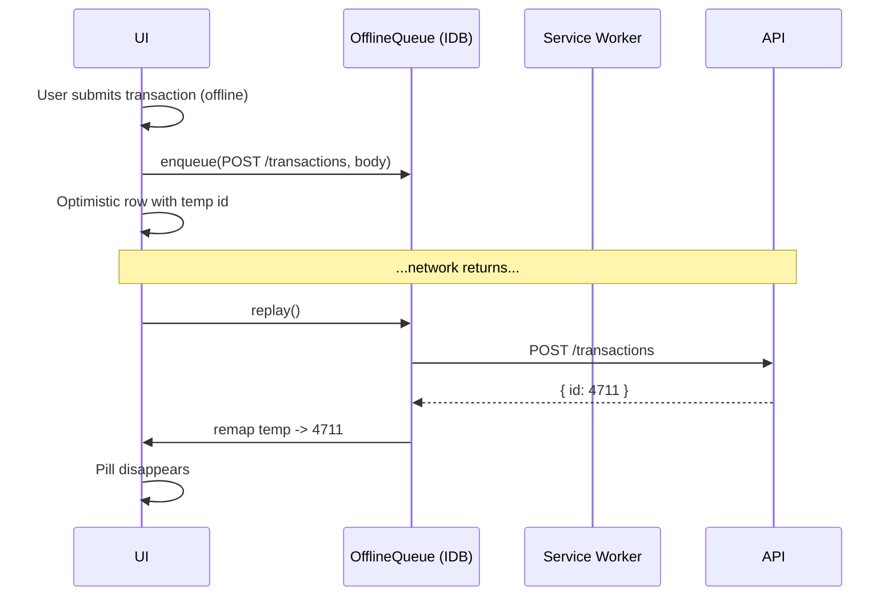

# PWA and Offline Support

## Summary

OpenSid runs in a desktop browser today; users often want to add a transaction the moment they pay for something, from their phone. This feature ships OpenSid as an installable Progressive Web App with offline support. Reads are served from a local cache; writes are queued in IndexedDB while offline and replayed on reconnect. The user can install OpenSid to the home screen, launch standalone, and capture entries in the field.

## Requirements

- App is installable to home screen (iOS / Android / desktop)
- Service worker caches the app shell and recent API GET responses
- "Add transaction" works offline: writes are queued in IndexedDB and replayed when online
- Replay handles conflicts: server-side IDs are reconciled into the cache
- Offline indicator: a banner shows when offline and a count of queued writes
- Manual "Sync now" action
- Background sync via the Service Worker `sync` event where supported
- Queue and cache cleared by a "Reset offline data" action

## Detailed description

### Stack additions

- `vite-plugin-pwa` configured for [client/vite.config.ts](client/vite.config.ts) with `workbox` strategies
- `idb` (npm package) for IndexedDB access in the queue layer
- `web-app-manifest` (`/public/manifest.webmanifest`) with name, short_name, icons, theme_color
- Icons: `/public/icons/{192,512}.png` (regenerated from the existing logo)

### Service-worker strategy

- **App shell** (`/`, `/assets/*`, `/index.html`): precached at build time
- **API GETs** (`/api/accounts`, `/api/accounts/:id/transactions`, `/api/dashboard*`, `/api/categories`, `/api/budgets/*/progress`): `stale-while-revalidate` with 1-day max-age
- **API non-GET**: not cached — handled by the offline queue
- **Attachments** (`/api/attachments/:id/file`): `cache-first` with size cap (e.g. 50 MB total)

### Offline queue

A single IndexedDB database `opensid-offline` with object stores:

```ts
queue: {
    id: number;                         // auto-increment
    method: 'POST' | 'PUT' | 'DELETE';
    url: string;
    body: any;                          // JSON
    headers: Record<string, string>;
    created_at: string;
    state: 'pending' | 'in_flight' | 'failed';
    last_error?: string;
    // For temp-id remapping
    temp_id?: string;
    resolves_temp_id_in?: string[];     // body fields that contain the temp id
}

cache_metadata: { key: string; updated_at: string; }
```

### Optimistic UI

When the user submits a transaction offline:

1. The client generates a `temp_id` (UUIDv4-ish) and writes the transaction into the React Query cache with `id = -temp_id` (negative to never collide).
2. The submission is enqueued.
3. The UI shows the row with a small "Pending" pill.
4. On replay success, the server's real id replaces the temp id in the cache; the pill disappears.
5. On replay failure (non-network — e.g. 4xx), the queue entry is marked `failed`; the user sees a banner with retry/dismiss.

### Temp-id remapping

If the user creates a transaction offline then edits or splits it offline, the second request references a temp id. The queue tracks `resolves_temp_id_in` (paths in the body that need rewriting). Before sending, the queue runner replaces temp ids with real ids resolved from earlier requests.

### Replay

- Triggered by: app focus, `online` event, manual "Sync now", and (where supported) Service Worker `sync` event.
- Runs serially; FIFO; stops on first non-network error (failed item stays at the head until user acts).
- All queue mutations and replays are funnelled through a single `OfflineQueue` singleton.

### Conflict handling

The server is the source of truth. Optimistic updates that conflict (e.g. account was deleted server-side while the user added a transaction to it offline) surface as a failed item with the server's 4xx body in `last_error`. The user can dismiss (deleting the queue entry) or open the entry's payload as a draft to retry against a different account.

### Offline UI

- Persistent footer chip: "Offline — N queued" when offline, "Syncing N…" while replaying.
- Settings → Offline:
  - **Sync now** button
  - **Reset offline data** (clears IDB; preserves logged-in/session state)
  - **Storage usage** rough estimate from `navigator.storage.estimate()`

### Auth interaction

OpenSid is single-user, no auth today. If multi-user (feature 15) lands, the queue is namespaced by user id and cleared on user change. For the MVP single-user case, no namespacing is required.

### Constraints

- Attachments uploaded offline are tricky (binary blobs in IDB are fine but storage may be tight). MVP: attachments fail offline with a clear "Connect to upload receipts" message — the rest of the transaction goes through.
- Long offline periods may stale-cache balances and reports. The UI labels cached responses with their fetched timestamp inside an info chip.

## User stories

- As a user, I want to install OpenSid to my phone's home screen, so that it opens like a native app.
- As a user, I want to add a transaction while offline, so that I don't forget purchases away from coverage.
- As a user, I want my offline entries to sync automatically when I'm back online, so that I don't have to think about it.
- As a user, I want a clear indicator when something failed to sync, so that I can fix it before it's forgotten.

## Key decisions

| Decision | Outcome |
|----------|---------|
| Toolchain | `vite-plugin-pwa` + Workbox + `idb` |
| Cache strategy | App shell precached; API GETs stale-while-revalidate; attachments cache-first with cap |
| Offline writes | Queued in IDB with optimistic UI; temp-id remapping |
| Replay trigger | `online`, focus, manual, Service Worker `sync` where supported |
| Conflicts | Surface as failed items; user resolves; no auto-merge |
| Attachments offline | MVP excludes binary uploads; clear message |
| Multi-user | Out of scope here; would require namespacing in feature 15 |

## Validation

| Rule | Error message |
|------|---------------|
| Failed queue item: shown until user acts | "Couldn't sync: <last_error>" with Retry / Dismiss |
| Reset offline data requires confirmation | "This clears your local cache and any pending offline changes. Continue?" |

## Diagrams



## Acceptance criteria

```gherkin
Feature: PWA and offline

  Scenario: Install prompt
    When I open OpenSid in a supported browser
    Then I can install it to the home screen and launch it standalone

  Scenario: Offline add
    Given I am offline
    When I add a transaction
    Then it appears in the list with a "Pending" pill
    And the offline indicator shows "Offline — 1 queued"

  Scenario: Auto-sync on reconnect
    Given there are 3 pending queue items
    When the device comes back online
    Then the queue is replayed in order
    And the pills disappear as items succeed

  Scenario: Temp-id remapping
    Given I created a transaction offline (temp id T1)
    And I then edited the same transaction offline
    When the queue replays
    Then the POST returns id 5
    And the subsequent PUT targets id 5

  Scenario: Failed item surfaces
    Given a queued POST that returns 400 on replay
    Then the queue entry is marked failed
    And a banner offers Retry and Dismiss

  Scenario: Cached data shown offline
    Given I previously loaded the dashboard online
    When I open the dashboard offline
    Then the last-fetched dashboard is shown with a "Last updated <time>" chip

  Scenario: Attachment upload offline
    Given I am offline
    When I attempt to upload a receipt to a transaction
    Then I see "Connect to upload receipts"

  Scenario: Reset offline data
    When I click Reset offline data and confirm
    Then the IndexedDB cache and queue are cleared
```

## Manual test steps

1. Open OpenSid in Chrome/Edge on a phone. Install to home screen. Launch from the home screen; confirm standalone (no browser chrome).
2. Go offline (airplane mode). Add a transaction; confirm the row appears with a "Pending" pill and the footer says "Offline — 1 queued".
3. Edit that transaction (still offline); confirm the optimistic update.
4. Re-enable connectivity; confirm the queue replays automatically; the pill clears; balances update.
5. Force a failure: edit the transaction's account to a deleted account; observe failed banner; click Dismiss.
6. Open the dashboard offline after previously visiting it online; confirm cached content with a "Last updated …" chip.
7. Try to upload a receipt offline; confirm the explanatory message.
8. Settings → Offline → Reset offline data; confirm storage clears.

## Implementation tasks

1. **Vite PWA plugin**
   - Install `vite-plugin-pwa` and `workbox-window`.
   - [client/vite.config.ts](client/vite.config.ts) — register plugin with the manifest and runtime caching rules.
   - Add icons in `client/public/icons/`.
2. **Manifest**
   - `client/public/manifest.webmanifest` — name, short_name, theme, icons.
3. **Offline queue**
   - New file: [client/src/offline/queue.ts](client/src/offline/queue.ts) — `enqueue`, `peek`, `replay`, `remap`, `reset`. Uses `idb`.
   - New file: [client/src/offline/tempId.ts](client/src/offline/tempId.ts) — generate / detect temp ids.
4. **Axios interceptor**
   - [client/src/api/client.ts](client/src/api/client.ts) (new shared axios instance if not already present) — on network error for non-GET requests, enqueue and return an optimistic payload.
5. **Cache integration**
   - In each API caller (`client/src/api/*`), keep current shape; the SW handles GET caching transparently. For optimistic creates, write into React Query caches with temp ids.
6. **Offline indicator**
   - New file: [client/src/components/OfflineIndicator.tsx](client/src/components/OfflineIndicator.tsx) — listens to `online`/`offline` events and queue state.
   - [client/src/components/Page.tsx](client/src/components/Page.tsx) — mount the footer chip.
7. **Settings — Offline section**
   - New file: [client/src/components/settings/OfflineSection.tsx](client/src/components/settings/OfflineSection.tsx).
8. **Tests**
   - Queue: enqueue/replay ordering, temp-id remapping, failed-state surfacing.
   - PWA smoke test: SW registers in dev or build harness.
