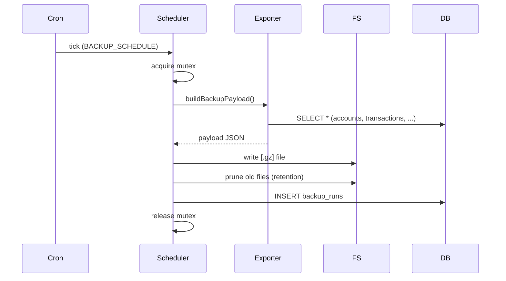

# Scheduled Automated Backups

## Summary

Manual backup export already exists at `/api/backup`. For a self-hosted single-user app, a forgotten backup is a lost user. This feature adds a server-side cron job that writes full backups to a configurable directory with N-day retention. Backups land as timestamped JSON files (or `.json.gz`) inside the volume the user already mounts for `DATABASE_PATH`. Recovery is the standard import flow.

## Requirements

- Cron-driven daily backup (configurable schedule)
- Output written to a configurable directory (env: `BACKUP_DIR`)
- File naming: `opensid-backup-YYYY-MM-DDTHH-mm-ss.json` (optionally `.json.gz` when `BACKUP_GZIP=true`)
- Retention: keep the most recent N (`BACKUP_RETAIN`, default 14); delete older
- Disabled by default (no `BACKUP_DIR` set means feature off)
- Status surfaced in Settings: last successful, last attempted, last error, file list
- Manual "Run backup now" button in Settings that writes to the same directory
- File-system errors logged and surfaced to the UI without crashing the app

## Detailed description

### Environment configuration

```
BACKUP_DIR=/data/backups        # required to enable; absolute path inside the container
BACKUP_SCHEDULE=0 2 * * *       # cron expression; default daily at 02:00 server local time
BACKUP_RETAIN=14                # keep N most recent files
BACKUP_GZIP=true                # gzip the JSON (default true)
```

Backups land in `BACKUP_DIR` which is expected to be a mounted volume (separate from the SQLite data path, or a subdirectory).

### Schedule registration

`node-cron` already runs in [server/src/index.ts](server/src/index.ts). Add a second schedule that calls `runScheduledBackup()` from a new `backup/scheduler.ts`.

### Backup payload reuse

The existing `/api/backup` export logic (in [server/src/backup/exportRoutes.ts](server/src/backup/exportRoutes.ts)) is refactored to expose a pure `buildBackupPayload(): BackupPayload`. The route uses it; the scheduler uses it. No duplication.

### Writer

```ts
async function runScheduledBackup(): Promise<BackupRunResult> {
    if (!process.env.BACKUP_DIR) return { skipped: 'disabled' };
    const dir = process.env.BACKUP_DIR;
    await fs.promises.mkdir(dir, { recursive: true });
    const payload = buildBackupPayload();
    const stamp = new Date().toISOString().replace(/[:.]/g, '-');
    const base = `opensid-backup-${stamp}`;
    const path = process.env.BACKUP_GZIP === 'false'
        ? `${dir}/${base}.json`
        : `${dir}/${base}.json.gz`;
    // stream JSON.stringify through gzip into the file
    await writeFile(path, payload);
    pruneRetention(dir, parseInt(process.env.BACKUP_RETAIN ?? '14', 10));
    recordRun({ ok: true, path, size_bytes: ... });
    return { ok: true, path };
}
```

The `backup_runs` table (below) records each attempt.

### Run history

```sql
CREATE TABLE IF NOT EXISTS backup_runs (
    id          INTEGER PRIMARY KEY AUTOINCREMENT,
    started_at  DATETIME NOT NULL DEFAULT (datetime('now')),
    finished_at DATETIME,
    ok          INTEGER NOT NULL DEFAULT 0,
    path        TEXT,
    size_bytes  INTEGER,
    error       TEXT
);
```

Trimmed to last 200 rows on each write.

### Endpoints

- `GET /api/backup/scheduled/status` — returns the last 20 runs, current config (resolved env), and a list of files in `BACKUP_DIR` with their sizes.
- `POST /api/backup/scheduled/run-now` — invokes `runScheduledBackup()` immediately; returns the result.

(Reading files lists is read-only; no API endpoint to download — recovery is via the existing import flow with the file the operator has on disk.)

### Settings UI

A new "Scheduled backups" section in Settings showing:

- Status: Enabled / Disabled (based on `BACKUP_DIR`).
- Schedule (cron string), retention, gzip flag.
- Last run: timestamp, ok/error, file path, size.
- Recent runs table.
- Files in directory: name, size, modified date.
- **Run backup now** button.

The section is read-only because env vars are how the user configures it (consistent with `DATABASE_PATH` / `CORS_ORIGIN`).

### Retention

On each successful write, list files in `BACKUP_DIR` matching `opensid-backup-*.json{,.gz}`, sort by mtime desc, delete beyond index `N-1`. Failures during pruning are logged but do not fail the backup.

### Failure modes

- Directory not writable → recorded as an error run; the next dashboard load surfaces a toast.
- Disk full → ENOSPC error captured; partial file (if any) is deleted to avoid corrupt restores.
- Concurrent runs (manual + cron) → guarded by an in-process mutex (a simple `let inFlight = false`).

### Restore

Existing `/api/backup` (import) handles `.json.gz` by content-type sniffing: if filename ends in `.gz` or content begins with `1f 8b`, gunzip first. Restore otherwise unchanged.

## User stories

- As an operator self-hosting OpenSid, I want automatic nightly backups, so that disk-loss doesn't lose my data.
- As an operator, I want old backups pruned automatically, so that my disk doesn't fill up.
- As a user, I want to see when my last backup happened, so that I trust it's running.
- As a user, I want a manual "Run now" button, so that I can take a fresh backup before a risky change.

## Key decisions

| Decision | Outcome |
|----------|---------|
| Configuration | Env vars only (consistent with current operator workflow) |
| Disabled by default | If `BACKUP_DIR` is unset, the feature is dormant |
| File format | Same JSON as `/api/backup` export, optionally gzipped |
| Restore | Existing import endpoint; gzip auto-detected |
| History | `backup_runs` table, trimmed to last 200 |
| Concurrency | In-process mutex; manual run + cron can't overlap |
| Failure visibility | Surfaced in Settings; toast on dashboard for very recent failures |

## Validation

| Rule | Error message |
|------|---------------|
| `BACKUP_DIR` must be writable | "Backup directory is not writable: <path>" |
| `BACKUP_SCHEDULE` is a valid cron expression | "Invalid cron expression: <value> — falling back to default 0 2 * * *" (warn, don't crash) |
| `BACKUP_RETAIN ≥ 1` | "BACKUP_RETAIN must be ≥ 1 — falling back to 14" |

## Diagrams



## Acceptance criteria

```gherkin
Feature: Scheduled backups

  Scenario: Disabled by default
    Given BACKUP_DIR is not set
    When the cron schedule fires
    Then no backup is attempted
    And the Settings page shows "Disabled"

  Scenario: Daily backup writes a gzipped file
    Given BACKUP_DIR=/data/backups and BACKUP_GZIP defaults to true
    When the cron schedule fires
    Then a file opensid-backup-YYYY-MM-DDTHH-mm-ss.json.gz appears in the directory
    And a backup_runs row is inserted with ok=1

  Scenario: Retention prunes old files
    Given 15 backups already exist and BACKUP_RETAIN=14
    When a new backup succeeds
    Then the oldest file is deleted, leaving 14

  Scenario: Run now
    When I click "Run backup now"
    Then a new file is written and the runs table updates

  Scenario: Failure recorded
    Given BACKUP_DIR points to a non-writable path
    When the cron fires
    Then a backup_runs row is inserted with ok=0 and an error message
    And the Settings page shows "Last error: …"

  Scenario: Concurrent run prevented
    Given a backup is in progress
    When I click "Run backup now"
    Then I see "Backup is already running"

  Scenario: Restore from a gzipped backup
    Given a opensid-backup-….json.gz file
    When I upload it via the existing Import flow
    Then the file is gunzipped and applied like a regular backup
```

## Manual test steps

1. Set `BACKUP_DIR=/data/backups` in `.env`. Restart the server.
2. Settings → Scheduled backups. Confirm "Enabled" status, schedule, retention.
3. Click "Run backup now". Confirm a new file appears in the directory and in the file list.
4. Move the system clock or use a tight cron expression to trigger a scheduled run; confirm another file appears.
5. Set retention to 2 and run several times; confirm only the 2 newest remain.
6. Make the directory read-only; run again; confirm an error run is recorded and surfaced.
7. Stop the server, copy a backup file, drop the DB, restart. Use the existing Import flow with the `.json.gz` file. Confirm full restore.
8. Unset `BACKUP_DIR`; restart; confirm Settings reports Disabled and the cron does nothing.

## Implementation tasks

1. **Refactor export to a pure builder**
   - [server/src/backup/exportRoutes.ts](server/src/backup/exportRoutes.ts) — extract `buildBackupPayload()` into a new [server/src/backup/builder.ts](server/src/backup/builder.ts). Route still works.
2. **Scheduler**
   - New file: [server/src/backup/scheduler.ts](server/src/backup/scheduler.ts) — env parsing, mutex, write, gzip, prune.
3. **Schema**
   - [server/src/db.ts](server/src/db.ts) — `backup_runs` table.
4. **Registration**
   - [server/src/index.ts](server/src/index.ts) — register the cron from `BACKUP_SCHEDULE`; run startup catch-up only if no backup has been written today.
5. **Routes**
   - New file: [server/src/backup/scheduledRoutes.ts](server/src/backup/scheduledRoutes.ts) — `/status`, `/run-now`.
6. **Import gzip detection**
   - [server/src/backup/importRoutes.ts](server/src/backup/importRoutes.ts) — sniff gzip magic bytes; gunzip before JSON.parse.
7. **Settings UI**
   - New file: [client/src/components/settings/ScheduledBackupsSection.tsx](client/src/components/settings/ScheduledBackupsSection.tsx) — status, recent runs, file list, Run-now button.
8. **Docs**
   - [README.md](README.md) — env var table updated with `BACKUP_DIR`, `BACKUP_SCHEDULE`, `BACKUP_RETAIN`, `BACKUP_GZIP`.
9. **Tests**
   - Builder produces a payload identical to the route.
   - Retention deletes the right files; non-matching files are untouched.
   - Concurrency: second `run-now` while in flight rejects.
