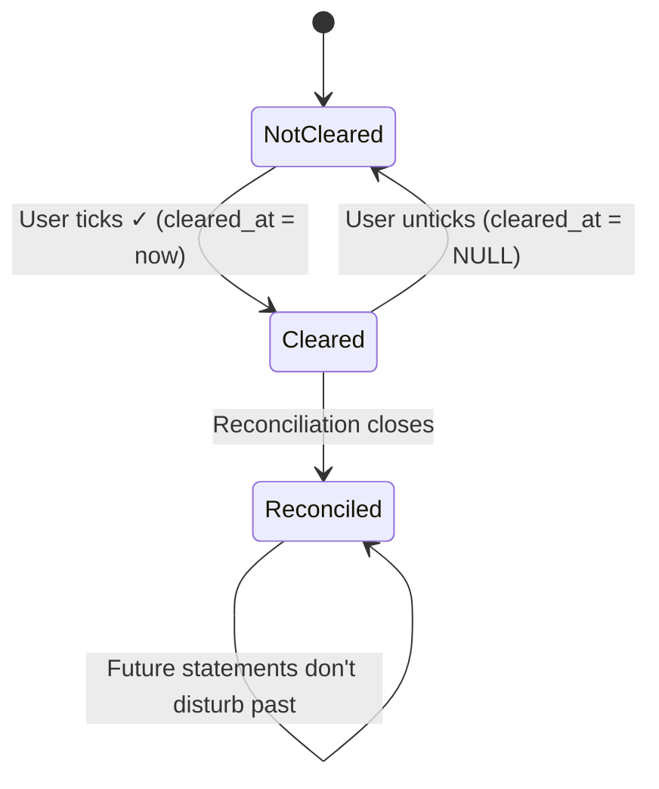

# Statement Reconciliation

## Summary

When the user checks their bank statement, they want to confirm OpenSid's records agree with the bank. This feature adds a per-transaction **cleared** state and a per-account **statement reconciliation** flow: the user enters the statement's closing balance and date, ticks off transactions that appear on the statement, and OpenSid shows running and target totals so they know when the books balance. It catches missed transactions and silent typos that drift the account balance from reality.

## Requirements

- A boolean `cleared` flag per transaction, with the timestamp it was cleared
- Running "cleared balance" computed per account (sum of `amount_cents` where `cleared = 1`)
- A new Reconcile mode on Account Detail with: target balance, target date, running totals, "Off by $X.XX" indicator
- Quick-clear with checkboxes in the transaction list (without entering full reconcile mode)
- Persist a history of reconciliation sessions per account: closing balance, date, completion timestamp
- Backup/restore preserves cleared state and reconciliation history

## Detailed description

### Schema

```sql
ALTER TABLE transactions ADD COLUMN cleared_at DATETIME;

CREATE TABLE IF NOT EXISTS reconciliations (
    id                INTEGER PRIMARY KEY AUTOINCREMENT,
    account_id        INTEGER NOT NULL REFERENCES accounts(id),
    statement_date    DATE NOT NULL,
    statement_balance_cents INTEGER NOT NULL,
    completed_at      DATETIME NOT NULL DEFAULT (datetime('now')),
    notes             TEXT
);
```

`cleared_at IS NULL` means uncleared. `cleared_at IS NOT NULL` is the timestamp the row was first cleared (re-clearing is a no-op). Un-clearing sets it back to NULL.

A completed reconciliation is the audit trail — it doesn't store which transactions were ticked off (the `cleared_at` timestamps already do that).

### Quick-clear UX

Each `TransactionRow` gains a small ✓ toggle on the left (visible on hover or always, decision below). Clicking toggles `cleared_at`. The Account Detail header gains a small chip:

> Cleared: $1,234.50 of $1,500.00 (account balance)

This works without entering reconcile mode and is enough for users who reconcile casually.

### Reconcile mode

A "Reconcile" button on the Account Detail header opens reconcile mode:

1. **Setup dialog** — user enters the statement closing balance and date (default: today).
2. **Reconcile view** — the transaction list filters to **transactions dated ≤ statement date**. Each row has a prominent ✓/✗ toggle.
3. **Persistent header**:
   - **Statement balance**: $1,500.00 (user-entered)
   - **Cleared balance**: $1,495.00 (sum of cleared rows ≤ statement date)
   - **Difference**: −$5.00 (red if non-zero, green when zero)
4. **Finish** button is enabled only when difference = 0. Clicking it:
   - Creates a `reconciliations` row.
   - Returns to normal Account Detail.

The user can leave reconcile mode at any time without finishing; cleared state already persists. They can also reopen and continue.

### Settings → Reconciliation history

A new Settings section lists past reconciliations per account: date, statement balance, completed at, optional notes. Each row links to the snapshot of cleared transactions ≤ statement date (a read-only list view).

### Filters integration

`TransactionFilters` gains `cleared?: 'yes' | 'no'`. Surfaced in the filter drawer ("Cleared: Any / Yes / No"). Lets the user quickly see "uncleared older than 30 days" — items that may have fallen through the cracks.

### Backup

`BackupTransaction` gains `cleared_at`. Add `reconciliations` array to the backup payload.

## User stories

- As a user, I want to tick off transactions that match my bank statement, so that I can trust OpenSid's balance.
- As a user, I want a "you're off by $X" indicator while reconciling, so that I know when I'm done.
- As a user, I want to filter to uncleared transactions, so that I can chase down stale items.
- As a user, I want past reconciliations recorded, so that I have an audit trail of when the account agreed with the bank.

## Key decisions

| Decision | Outcome |
|----------|---------|
| Cleared model | A `cleared_at` timestamp on transactions (NULL = uncleared) |
| Reconciliation history | Separate `reconciliations` table — minimal: statement date, balance, completion timestamp, notes |
| Quick-clear visibility | Visible always on the row (small, low-contrast); not hidden behind hover (touch-first) |
| Reconcile filter scope | Reconcile mode lists transactions dated ≤ statement date only |
| Re-clearing | Idempotent — already-cleared rows ignore re-clear; unclearing clears `cleared_at` |
| Transfers | Both sides have independent cleared state (each appears on a different statement) |
| Difference computation | `statement_balance_cents` − (starting balance + sum of cleared ≤ date) — see implementation |

The "difference = 0" calculation: starting balance for reconciliation = balance from the last finished reconciliation for that account (or 0 for the first). Cleared change during this reconciliation = sum of `amount_cents` for rows with `cleared_at` between last reconciliation's `completed_at` and now, dated ≤ statement date. `expected = previous_statement_balance + cleared_change`. `difference = statement_balance − expected`.

## Validation

| Rule | Error message |
|------|---------------|
| `statement_date` is required and not in the future | "Statement date cannot be in the future" |
| `statement_balance_cents` is required | "Statement balance is required" |
| Cannot finish reconciliation when difference ≠ 0 | (Finish button disabled with tooltip "Off by $X — clear or uncheck transactions to match") |

## Diagrams



## Acceptance criteria

```gherkin
Feature: Reconciliation

  Scenario: Quick-clear from the list
    Given an uncleared transaction
    When I click its ✓ toggle
    Then cleared_at is set to now
    And the header chip "Cleared: $X of $Y" updates accordingly

  Scenario: Un-clear
    Given a cleared transaction
    When I click its ✓ toggle
    Then cleared_at is set to NULL

  Scenario: Enter reconcile mode
    Given I am on Account Detail
    When I click Reconcile and enter statement date today and balance $1,500
    Then the list filters to transactions dated ≤ today
    And the header shows Statement / Cleared / Difference

  Scenario: Finish requires zero difference
    Given Difference is −$5.00
    Then the Finish button is disabled
    When I clear one more $5.00 transaction
    Then Difference is $0.00 and Finish is enabled

  Scenario: Finish creates a reconciliation record
    When I click Finish with Difference $0.00
    Then a row is added to reconciliations with statement_date, statement_balance, completed_at
    And I return to Account Detail

  Scenario: Reconcile mode is resumable
    Given I left reconcile mode without finishing
    When I re-enter Reconcile and re-enter the same date and balance
    Then previously-cleared rows are still cleared
    And the difference reflects current cleared state

  Scenario: Filter by uncleared
    When I set the Cleared filter to "No"
    Then only rows with cleared_at IS NULL are shown

  Scenario: History view lists past reconciliations
    Given I have completed 3 reconciliations
    When I open Settings > Reconciliation history for this account
    Then I see 3 rows listing date, balance, completed_at

  Scenario: Backup preserves cleared and history
    When I export and re-import a backup
    Then transactions retain cleared_at
    And reconciliations rows are restored
```

## Manual test steps

1. On Account Detail, confirm a ✓ toggle is visible to the left of each transaction. Click one. Confirm it stays on after refresh.
2. Confirm the header now shows "Cleared: $X of $Y".
3. Click Reconcile. Enter today as the statement date and a number 5¢ off from "Cleared". Submit.
4. Confirm the list filters to transactions ≤ today, and a header shows Statement / Cleared / Difference with the right values.
5. Confirm the Finish button is disabled while Difference ≠ 0.
6. Toggle cleared on rows to bring Difference to zero. Confirm Finish enables.
7. Click Finish. Confirm you return to Account Detail and the reconciliation appears in Settings > Reconciliation history.
8. Open the filter drawer and set Cleared = No. Confirm only uncleared rows show.
9. Export a backup; import to a clean DB; confirm cleared markings and history persist.

## Implementation tasks

1. **Schema**
   - [server/src/db.ts](server/src/db.ts) — `ALTER TABLE transactions ADD COLUMN cleared_at`; `CREATE TABLE reconciliations`.
2. **Repository changes**
   - [server/src/transactions/repository.ts](server/src/transactions/repository.ts) — `clear(id)`, `unclear(id)`; extend `TransactionFilters` with `cleared`.
   - New file: [server/src/reconciliations/repository.ts](server/src/reconciliations/repository.ts) — `list(accountId)`, `create(...)`, `getLast(accountId)`.
3. **Routes**
   - [server/src/transactions/routes.ts](server/src/transactions/routes.ts) — `PUT /:id/cleared` `{ cleared: boolean }`.
   - New file: [server/src/reconciliations/routes.ts](server/src/reconciliations/routes.ts) — `GET /api/accounts/:id/reconciliations`, `POST`.
4. **Cleared balance endpoint**
   - [server/src/accounts/routes.ts](server/src/accounts/routes.ts) — `GET /:id/cleared-balance` returns total of cleared cents.
5. **Client UI**
   - [client/src/components/TransactionRow.tsx](client/src/components/TransactionRow.tsx) — ✓ toggle.
   - [client/src/pages/AccountDetail.tsx](client/src/pages/AccountDetail.tsx) — header chip; Reconcile button.
   - New file: [client/src/components/ReconcileBar.tsx](client/src/components/ReconcileBar.tsx) — sticky header during reconcile.
   - New file: [client/src/components/ReconcileSetupDialog.tsx](client/src/components/ReconcileSetupDialog.tsx).
6. **History UI**
   - New file: [client/src/components/settings/ReconciliationHistorySection.tsx](client/src/components/settings/ReconciliationHistorySection.tsx).
7. **Backup**
   - Add `cleared_at` to `BackupTransaction`; add `reconciliations` array; merge by `(account_id, statement_date, statement_balance_cents)`.
8. **Tests**
   - Difference math against the last reconciliation; idempotent re-clear; filter behaviour.
