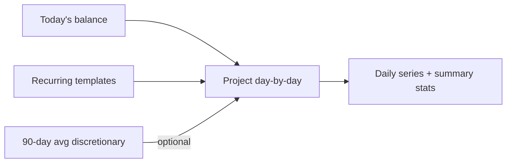

# Forecast Tile

## Summary

The recurrence engine already knows which income and expense rows will land in the next N days. This feature surfaces that as a **Forecast** dashboard tile that projects future account balance: today's balance + scheduled recurring transactions + an optional estimate of discretionary spend based on the rolling 90-day average. The result is a clear "you'll have $X on June 15" line, the date you'd hit zero (if any), and a chart of projected balance over the configurable window.

## Requirements

- New tile type `forecast` scoped to one account
- Default window 30 days, configurable: 14d / 30d / 60d / 90d
- Projection components: starting balance + future scheduled recurring transactions
- Optional "include average discretionary spend" toggle: uses last-90-days average non-recurring expense per day
- Highlight: projected closing balance, lowest projected balance (with date), date of zero crossing if any
- Line chart of projected balance over the window
- Per-day breakdown table (collapsible)
- Backup/restore preserves tile configuration

## Detailed description

### Inputs

For account A, window `[today+1, today+N]`:

1. **Starting balance** = current account balance.
2. **Scheduled recurring** = for each non-deleted template (`recurrence IS NOT NULL`) belonging to A (including transfers where A is source or destination), enumerate due dates in the window (excluding past) using the same arithmetic as [server/src/recurrence/service.ts](server/src/recurrence/service.ts). Sum signed cents per day.
3. **Discretionary estimate (optional)**: average daily non-recurring, non-transfer spend over the last 90 days, applied as a negative cents-per-day across the window.

`balance_on(day) = starting_balance + sum(scheduled[ : day]) - discretionary_per_day * (day - today)`.

### Endpoint

`GET /api/accounts/:id/forecast?days=30&include_discretionary=true`:

```json
{
  "starting_balance_cents": 250000,
  "window_days": 30,
  "include_discretionary": true,
  "discretionary_per_day_cents": 1234,
  "closing_balance_cents": 187050,
  "lowest_balance_cents": 162300,
  "lowest_balance_date": "2026-06-24",
  "zero_crossing_date": null,
  "events": [
    { "date": "2026-06-01", "label": "Salary", "amount_cents": 250000, "kind": "recurring" },
    { "date": "2026-06-01", "label": "Rent",   "amount_cents": -180000, "kind": "recurring" }
  ],
  "daily": [
    { "date": "2026-05-29", "balance_cents": 248766 },
    ...
  ]
}
```

### Tile UI

Headline cards across the top:

- **Closing on <date>**: $1,870.50
- **Lowest**: $1,623.00 on 24 Jun
- **Zero on**: 7 Jul (red) — or "Stays positive" (green)

Below, a line chart over the window (uses the same chart library as `BalanceChartTile`). The recurring events are dot-annotated on the line.

Below the chart, a collapsible **Events** table listing each scheduled occurrence with date, description, amount.

Settings on the tile (gear): window length (segmented control), discretionary toggle.

### Discretionary estimate caveats

The estimate is approximate by design. The tile's tooltip explicitly says:

> Discretionary estimate is your average non-recurring, non-transfer expense per day over the last 90 days, projected forward at a flat rate. It's a rough guide, not a forecast of any specific transaction.

This is honest and prevents the user from treating the line as a guarantee.

### Schema

No new table needed; the dashboard tile configuration already supports `tile_type` and `time_window`. Extend `time_window` to accept `14d / 30d / 60d / 90d`. Discretionary on/off is stored as a serialized blob in a new column or by adding a column `forecast_discretionary INTEGER DEFAULT 0`. Simpler: add the column.

```sql
ALTER TABLE dashboard_config ADD COLUMN forecast_discretionary INTEGER NOT NULL DEFAULT 0;
```

### Soft-delete & transfers

- Soft-deleted recurring templates produce no scheduled events.
- Transfer templates produce one signed event on the queried account (positive if A is destination, negative if A is source).

### Performance

For a 30-day window with O(10) recurring templates, the projection is trivial — pure JS arithmetic. No caching needed.

## User stories

- As a user, I want to see where my balance is heading, so that I can plan around upcoming bills.
- As a user, I want to know if I'll hit zero, so that I can move money before I do.
- As a user, I want an optional discretionary estimate, so that the forecast isn't unrealistically rosy.
- As a user, I want to see which specific scheduled transactions move the line, so that I know what's driving the dips.

## Key decisions

| Decision | Outcome |
|----------|---------|
| Inputs | Current balance + future recurring; optional flat discretionary estimate |
| Discretionary method | 90-day average non-recurring, non-transfer expense — flat per-day |
| Window options | 14 / 30 / 60 / 90 days |
| Schema | Reuse `dashboard_config.time_window`; add `forecast_discretionary` boolean |
| Honesty | Tooltip clearly says the estimate is a rough guide, not a prediction |
| Granularity | Daily |
| Transfers | Affect both sides of source/destination accounts |

## Validation

| Rule | Error message |
|------|---------------|
| `days` must be one of 14/30/60/90 | "Invalid window" |
| Account must exist and not be deleted | "Account not found" |

## Diagrams



## Acceptance criteria

```gherkin
Feature: Forecast tile

  Scenario: Default forecast
    Given an account with balance $2,500 and one monthly $1,800 rent recurrence on the 1st
    When I view a 30-day forecast tile today (28 May)
    Then the chart drops by $1,800 on 1 Jun
    And the closing-balance line reflects $700 (assuming no other events)

  Scenario: Discretionary estimate
    Given the last 90 days have non-recurring expense totalling $3,600 (avg $40/day)
    When I enable include_discretionary on a 30-day window
    Then the projection subtracts ~$40 per day from the running balance

  Scenario: Zero-crossing
    Given the projection dips below zero on 7 Jul
    Then the tile shows "Zero on 7 Jul" in red

  Scenario: Stays positive
    Given the projection never drops below zero in the window
    Then the tile shows "Stays positive"

  Scenario: Lowest point
    Given the projection's minimum is $1,623.00 on 24 Jun
    Then the tile highlights that value and date

  Scenario: Transfers affect forecast
    Given a fortnightly transfer of $200 from this account to another
    When the next due date is inside the window
    Then the projection drops $200 on that date

  Scenario: Soft-deleted recurrence has no effect
    Given a recurring template was soft-deleted
    Then it contributes no events to the forecast

  Scenario: Window switch
    Given a 30-day forecast tile
    When I switch to 90-day
    Then the chart and the events table extend accordingly
```

## Manual test steps

1. Pick an account with at least two recurring templates (one income, one expense).
2. Add a `forecast` tile to the dashboard for this account.
3. Confirm the headline cards: Closing on <date>, Lowest with date, Zero on / Stays positive.
4. Confirm the chart draws and the recurring events annotate the line.
5. Toggle "Include discretionary"; confirm the slope steepens by approximately the 90-day average daily expense.
6. Change the window to 90 days; confirm the chart and events extend.
7. Soft-delete a recurring template; confirm it disappears from the forecast and the line shifts.
8. Make a transfer template; confirm it shows in the events list with the correct sign.

## Implementation tasks

1. **Forecast service**
   - New file: [server/src/forecast/service.ts](server/src/forecast/service.ts) — pure function `computeForecast({ accountId, days, includeDiscretionary }) → ForecastPayload`. Uses recurrence date arithmetic from [server/src/recurrence/service.ts](server/src/recurrence/service.ts) (extract a shared helper if needed).
2. **Discretionary estimator**
   - In `forecast/service.ts` — `averageDailyDiscretionary(accountId)`: sum of expense `amount_cents` over last 90 days where `recurrence IS NULL AND recurrence_source_id IS NULL AND type='expense'`, divided by 90. Excludes transfers (`type != 'transfer'`).
3. **Route**
   - New file: [server/src/forecast/routes.ts](server/src/forecast/routes.ts) — `GET /api/accounts/:id/forecast?days=&include_discretionary=`.
4. **Dashboard config**
   - [server/src/db.ts](server/src/db.ts) — `ALTER TABLE dashboard_config ADD COLUMN forecast_discretionary INTEGER DEFAULT 0`.
   - [server/src/dashboard-config/routes.ts](server/src/dashboard-config/routes.ts) — accept `forecast_discretionary`; allow new window codes.
5. **Client**
   - New file: [client/src/api/forecast.ts](client/src/api/forecast.ts).
   - New file: [client/src/components/ForecastTile.tsx](client/src/components/ForecastTile.tsx) — headline cards + line chart + events table.
   - [client/src/pages/Dashboard.tsx](client/src/pages/Dashboard.tsx) — render the new tile type.
   - [client/src/components/settings/DashboardSection.tsx](client/src/components/settings/DashboardSection.tsx) — add Forecast option, discretionary toggle, window picker.
6. **Tests**
   - Service: known recurrence schedule yields known line; discretionary slope correct; zero-crossing detection; transfer signing.
