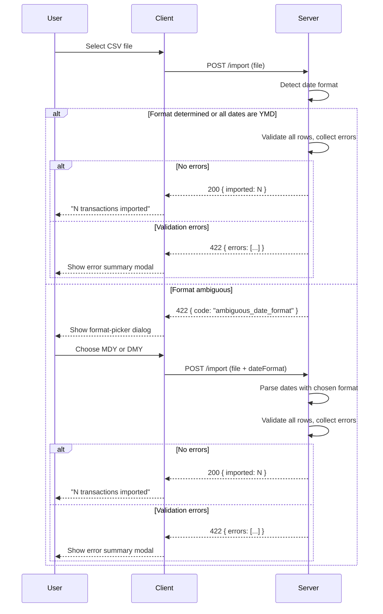

# Improve Transaction Import Handling

https://github.com/tanby-dynamics/opensid/issues/29

## Summary

The CSV transaction import feature has two areas that need improvement. First, its validation rules are misaligned with manual transaction creation — category should be required and description should be optional (falling back to category when blank). Second, date parsing is too strict: only `yyyy-MM-dd` with a hyphen divider is accepted, when users may export files using slash dividers or different field orderings. The new behaviour detects the date format from the file, asks the user to clarify when it cannot be determined automatically, and collects all row-level validation errors before reporting them as a summary rather than stopping at the first failure.

## Requirements

- Category should be required on import (matching manual transaction creation)
- Description should be optional on import (matching manual transaction creation)
- Date handling should accept `/` or `-` as dividers
- `yyyy/MM/dd` format should be accepted
- For ambiguous formats (`MM/dd/yyyy` vs `dd/MM/yyyy`), perform a best-guess scan across all dates in the file
- If the format cannot be determined, prompt the user to select it and retry
- Validation errors should be collected across all rows and shown as a summary (no longer stops at first error)

## Detailed description

### Validation alignment

The import route currently requires `description` and treats `category` as optional (nullable). This is the inverse of what manual transaction creation enforces. The change makes `category` required and `description` optional. When `description` is blank, the import falls back to the category value — matching the server-side behaviour in the manual creation route (`description?.trim() || categoryTrimmed`).

### Date format detection

All date handling is done server-side. The server normalises `/` separators to `-` before any parsing logic.

**Detection algorithm:**

1. If the date value matches `\d{4}-\d{2}-\d{2}` → parse as `yyyy-MM-dd` (unambiguous).
2. Otherwise, the date is assumed to be in `\d{2}-\d{2}-\d{4}` form (month or day first):
   - Scan all non-YMD dates in the file.
   - If any date has its **first** field > 12 → the format must be `dd/MM/yyyy` (DMY).
   - If any date has its **second** field > 12 → the format must be `MM/dd/yyyy` (MDY).
   - If both conditions appear in the same file → return a parsing error (contradictory format).
   - If neither field exceeds 12 in any date → the format is ambiguous; return a special 422 response.
3. Mixed files (some dates YMD, some not) are treated as a format error.

### Ambiguous format flow

When the server cannot determine the format, it returns HTTP 422 with `{ "code": "ambiguous_date_format" }`. The client intercepts this specific response and displays a format-picker dialog asking the user to choose between `MM/dd/yyyy` (Month/Day/Year) and `dd/MM/yyyy` (Day/Month/Year). The user's selection is sent as a `dateFormat` field in the FormData on the second request. The server uses this hint to parse all dates with that format.

### Error collection

Validation no longer stops at the first row error. All data rows are validated, all errors are collected, and if any errors exist the entire import is rejected (all-or-nothing). The 422 response body changes from `{ "error": "string" }` to `{ "errors": [{ "row": number, "error": "string" }] }`. The client displays these as a scrollable error summary (not a toast) so the user can see all problems at once.

## User stories

- As a user importing a bank export, I want slash-separated dates like `2024/01/15` or `15/01/2024` to be accepted, so that I don't have to manually reformat my file before importing.
- As a user, I want to be asked what date format my file uses when it can't be detected automatically, so that dates are never silently imported incorrectly.
- As a user, I want to see all validation errors in my CSV at once rather than fixing them one at a time, so that I can correct the whole file in a single pass.

## Key decisions

| Decision | Outcome |
|----------|---------|
| Where date format detection happens | Server-side on first parse pass; client handles the format-picker dialog and retry |
| How "ask the user" is triggered | Server returns `422 { code: "ambiguous_date_format" }`; client shows format-picker dialog and re-POSTs with `dateFormat` field |
| Format hint transport | `dateFormat` field in FormData (`'MDY'` or `'DMY'`); no change to the URL or headers |
| Best-guess disambiguation | Scan all dates in file; any field > 12 disambiguates. If contradictory → error. If all ≤ 12 → ask user |
| Error reporting | Collect all row errors, return as `{ errors: RowError[] }`; client shows a modal/summary instead of a toast |
| Description fallback | Empty description falls back to category value, matching the manual creation route |
| Import atomicity | Unchanged — all-or-nothing; no rows are inserted if any row fails validation |
| Category requirement | Required; empty category on any row fails the whole import |

## Validation

### Import row validation (updated)

| Rule | Error message |
|------|---------------|
| Date is present | `Row {n}: date is required` |
| Date is valid after format normalisation | `Row {n}: invalid date '{value}'` |
| Mixed date formats in file | `Row {n}: date format is inconsistent with other rows` |
| Category is present and non-empty | `Row {n}: category is required` |
| Type is `income` or `expense` | `Row {n}: type must be 'income' or 'expense'` |
| Amount is present | `Row {n}: amount is required` |
| Amount is a positive number | `Row {n}: amount must be a positive number` |

## Diagrams



## Acceptance criteria

```gherkin
Feature: Improved transaction import validation and date handling

  # --- Validation alignment ---

  Scenario: Category is required
    Given a CSV with a row where the category cell is empty
    When the user imports the file
    Then the import fails
    And the error summary includes "Row N: category is required"

  Scenario: Description is optional and falls back to category
    Given a CSV with a row where the description cell is empty and category is "Groceries"
    When the user imports the file
    Then the import succeeds
    And the imported transaction has description "Groceries"

  # --- Date format: YMD ---

  Scenario: yyyy-MM-dd with hyphen is accepted
    Given a CSV with date "2024-01-15"
    When the user imports the file
    Then the import succeeds and the transaction has date 2024-01-15

  Scenario: yyyy/MM/dd with slash is accepted
    Given a CSV with date "2024/01/15"
    When the user imports the file
    Then the import succeeds and the transaction has date 2024-01-15

  # --- Date format: unambiguous DMY/MDY ---

  Scenario: dd/MM/yyyy detected automatically when a day field exceeds 12
    Given a CSV containing date "25/01/2024"
    When the user imports the file
    Then the server detects DMY format
    And the import succeeds with date 2024-01-25

  Scenario: MM/dd/yyyy detected automatically when a month field would exceed 12 as day
    Given a CSV containing date "01/25/2024"
    When the user imports the file
    Then the server detects MDY format
    And the import succeeds with date 2024-01-25

  # --- Date format: ambiguous ---

  Scenario: Format picker shown when all date fields are ≤ 12
    Given a CSV where every date has both day and month fields ≤ 12 (e.g. "01/06/2024")
    When the user imports the file
    Then a format-picker dialog appears asking whether dates are MM/dd/yyyy or dd/MM/yyyy

  Scenario: Import succeeds after user selects format
    Given the format-picker dialog is showing
    When the user selects "Day/Month/Year (dd/MM/yyyy)"
    Then the file is re-submitted with dateFormat=DMY
    And the import succeeds with correctly parsed dates

  # --- Error collection ---

  Scenario: All row errors are collected and shown
    Given a CSV with three rows each having a different validation error
    When the user imports the file
    Then the import fails
    And the error summary shows all three errors
    And no transactions are inserted

  Scenario: Contradictory date formats across rows
    Given a CSV where some rows imply DMY and others imply MDY
    When the user imports the file
    Then the import fails with a date format consistency error
```

## Manual test steps

1. **Category required**: Create a CSV with a row where the Category cell is blank. Import it. Confirm the import fails and the error message mentions "category is required".

2. **Description optional**: Create a CSV with a row where the Description cell is blank and Category is "Groceries". Import it. Confirm the import succeeds and the transaction's description is "Groceries".

3. **Slash-separated YMD date**: Create a CSV with date `2024/03/15`. Import it. Confirm the transaction appears with date 15 March 2024.

4. **Auto-detect DMY**: Create a CSV with date `25/01/2024`. Import it. Confirm the transaction date is 25 January 2024 (not 1 December).

5. **Auto-detect MDY**: Create a CSV with date `01/25/2024`. Import it. Confirm the transaction date is 25 January 2024.

6. **Ambiguous format — dialog appears**: Create a CSV where all dates have both fields ≤ 12 (e.g. `06/01/2024`). Import it. Confirm a format-picker dialog appears with two options: `MM/dd/yyyy` and `dd/MM/yyyy`.

7. **Ambiguous format — pick DMY**: In the dialog, select Day/Month/Year. Confirm the import succeeds and dates are parsed as DMY.

8. **Ambiguous format — pick MDY**: Repeat step 6, this time select Month/Day/Year. Confirm dates are parsed as MDY.

9. **Multiple errors shown**: Create a CSV where row 2 has an empty category, row 4 has an invalid amount, and row 6 has an invalid type. Import it. Confirm all three errors appear in the summary, and no transactions are inserted.

10. **All-or-nothing on error**: After step 9, navigate to the transactions list and confirm no partial import occurred.

## Implementation tasks

Tasks must be completed in order due to dependencies.

1. **Update `ParseResult` and `ImportRow` types in [server/src/import/csv.ts](server/src/import/csv.ts)**
   - Change `category` on `ImportRow` from `string | null` to `string`
   - Add `RowError` interface: `{ row: number; error: string }`
   - Add `DateFormat` type: `'YMD' | 'MDY' | 'DMY'`
   - Update `ParseResult` union: `{ rows: ImportRow[] } | { errors: RowError[] } | { ambiguousDateFormat: true }`

2. **Add date parsing utilities in [server/src/import/csv.ts](server/src/import/csv.ts)**
   - Add `normaliseDateSeparator(s: string): string` — replaces `/` with `-`
   - Add `parseDate(s: string, format: DateFormat): string | null` — normalises, pattern-matches, returns `yyyy-MM-dd` or null
   - Add `detectDateFormat(dates: string[]): DateFormat | 'ambiguous' | 'error'` — implements the scan algorithm: if all match `\d{4}-\d{2}-\d{2}` → YMD; else scan first/second fields for values > 12; contradictory → `'error'`; none > 12 → `'ambiguous'`

3. **Rewrite `parseImportCSV` in [server/src/import/csv.ts](server/src/import/csv.ts)**
   - Accept optional second parameter `dateFormat?: DateFormat`
   - When no `dateFormat` provided: collect all raw date values, call `detectDateFormat`, return `{ ambiguousDateFormat: true }` if ambiguous or include a format error in `errors` if contradictory
   - Collect all row errors into `RowError[]` instead of returning on first error
   - Make category required: push `{ row: rowNum, error: 'category is required' }` when empty
   - Make description optional: `const description = rawDescription || category`
   - Return `{ errors }` if any errors, otherwise `{ rows }`

4. **Update import route in [server/src/import/routes.ts](server/src/import/routes.ts)**
   - Read optional `dateFormat` from `req.body` (FormData field), validate it is `'MDY'` or `'DMY'` if present
   - Pass it to `parseImportCSV(file.buffer, dateFormat)`
   - Handle `'ambiguousDateFormat' in result` → `res.status(422).json({ code: 'ambiguous_date_format' })`
   - Handle `'errors' in result` → `res.status(422).json({ errors: result.errors })`
   - Update `create()` call: `category` is now always a string (no `?? undefined` needed)

5. **Update `importTransactions` in [client/src/api/transactions.ts](client/src/api/transactions.ts)**
   - Add optional `dateFormat?: 'MDY' | 'DMY'` parameter
   - Append `dateFormat` to FormData when provided

6. **Add `DateFormatPickerDialog` component** (new file `client/src/components/DateFormatPickerDialog.tsx`)
   - Props: `onSelect: (format: 'MDY' | 'DMY') => void`, `onCancel: () => void`
   - Two choices: "Month/Day/Year (MM/dd/yyyy)" and "Day/Month/Year (dd/MM/yyyy)"
   - Follow the modal/dialog pattern used elsewhere in the codebase

7. **Update `handleImport` in [client/src/pages/AccountDetail.tsx](client/src/pages/AccountDetail.tsx)**
   - Add state for pending file and dialog visibility
   - On `ambiguous_date_format` 422 (check `err.response?.data?.code === 'ambiguous_date_format'`): store the file in state and show `DateFormatPickerDialog`
   - On format selection: call `importTransactions(accountId, pendingFile, dateFormat)` and handle result normally
   - On `errors` array 422 (check `err.response?.data?.errors`): show an error summary modal listing all `Row N: message` entries instead of a single toast
