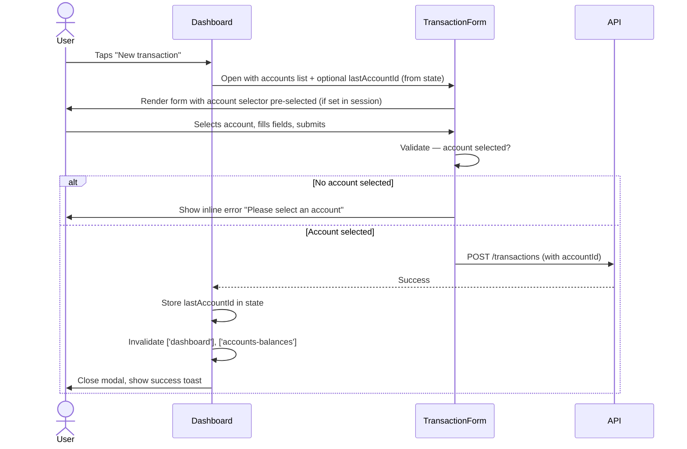

# Add "new transaction" button to the dashboard

https://github.com/tanby-dynamics/opensid/issues/32

## Summary

Add a "New transaction" button to the dashboard header, positioned right-aligned next to the existing "All accounts →" link. Tapping the button opens the existing `TransactionForm` modal with an additional "Account" selector at the top. The account selector is only shown when the modal is opened from the dashboard; opening the form from an account page continues to work as before. Within the same session, the last-selected account is pre-selected on subsequent opens of the modal.

## Detailed description

### Button placement

The dashboard header row currently contains a single `<PageLink>` element (`All accounts →`). The new "New transaction" button is placed in the same row, right-aligned, using a flex container with `justify-between` to separate the two elements.

The button is only rendered when the dashboard has accounts and at least one tile configured (i.e., neither the "no accounts" nor "no tiles configured" empty-state is showing).

### Modal behaviour

When the button is tapped, a new modal variant — distinct from the existing per-account `add-transaction` modal — is opened. This variant passes the full list of accounts to `TransactionForm` via a new optional prop, triggering the account selector to render.

The account selector appears at the top of the form, above all other fields, as a labelled `<select>` using the `.opensid-input` / `.opensid-label` design system classes. It lists all accounts returned by the existing `listAccountsWithBalances` query (already loaded on the dashboard). The placeholder option is "Select account…" with no value.

### Account persistence

When the user selects an account and submits the form, the selected account ID is stored in `Dashboard` component state. On subsequent opens of the "New transaction" modal within the same session, that account is pre-selected. The selection is not persisted across page refreshes or sessions.

### Validation

The form's existing submit handler is extended to check for a selected account when the account selector is visible. If none is selected, a validation error is displayed inline (using the same `FormErrors` mechanism already in `TransactionForm`) and submission is blocked.

### Post-submit

On success, the dashboard invalidates the `['dashboard']` and `['accounts-balances']` React Query keys (same as the per-account flow), the modal closes, and a success toast is shown.

## User stories

- As a user, I want to add a new transaction directly from the dashboard without first navigating to an account page, so that I can quickly record a transaction.
- As a user, I want the modal to remember which account I last used within my current session, so that I don't have to re-select it when adding multiple transactions in a row.

## Key decisions

| Decision | Outcome |
|---|---|
| Button placement | Right-aligned in the dashboard header row, beside "All accounts →", using flexbox |
| Account list source | All accounts via `listAccountsWithBalances` (already fetched on dashboard) |
| Default account selection | Blank ("Select account…") on first open; last-used account pre-selected for subsequent opens within the same session (stored in Dashboard state, not persisted) |
| Submit blocked without account | Yes — inline validation error, form does not submit |
| Account selector visibility | Controlled by a new optional prop on `TransactionForm`; not shown when form is opened from an account page |
| Post-submit behaviour | Dashboard data refreshes in place via query invalidation; no navigation |

## Validation

| Rule | Error message |
|---|---|
| Account selector visible and no account selected | "Please select an account" |

## Diagrams



## Acceptance criteria

```gherkin
Feature: New transaction button on dashboard

  Scenario: Button is visible when accounts and tiles exist
    Given the dashboard has at least one account and one configured tile
    Then a "New transaction" button is visible right-aligned next to "All accounts →"

  Scenario: Button is not visible when no accounts exist
    Given no accounts exist in the system
    Then the "New transaction" button is not visible

  Scenario: Button is not visible when no tiles are configured
    Given accounts exist but no dashboard tiles are configured
    Then the "New transaction" button is not visible

  Scenario: Opening the modal shows the account selector
    Given the dashboard has accounts
    When the user taps "New transaction"
    Then the transaction form modal opens
    And an "Account" selector is shown at the top of the form
    And the selector shows a blank "Select account…" placeholder on first use

  Scenario: Account selector lists all accounts
    Given accounts A, B, and C exist
    When the user taps "New transaction"
    Then the account selector contains options for A, B, and C

  Scenario: Submit is blocked without an account selected
    Given the "New transaction" modal is open
    And no account is selected
    When the user taps submit
    Then the form is not submitted
    And an inline error "Please select an account" is shown

  Scenario: Successful transaction creation refreshes the dashboard
    Given the "New transaction" modal is open
    And the user selects an account and fills in the required fields
    When the user submits the form
    Then the transaction is created
    And the modal closes
    And a success toast is shown
    And the dashboard tiles reflect the updated data

  Scenario: Last-selected account is remembered within the same session
    Given the user has already created a transaction from the dashboard selecting account B
    When the user taps "New transaction" again without refreshing the page
    Then account B is pre-selected in the account selector

  Scenario: Last-selected account is not remembered after a page refresh
    Given the user previously created a transaction from the dashboard selecting account B
    When the user refreshes the page and taps "New transaction"
    Then the account selector shows the blank placeholder

  Scenario: Account selector is not shown when form is opened from account page
    Given the user is on an account detail page
    When the user opens the new transaction form
    Then no account selector is shown in the form
```

## Manual test steps

1. Open the dashboard. Confirm a "New transaction" button appears to the right of "All accounts →" (only when accounts and tiles exist).
2. Tap "New transaction". Confirm the transaction form modal opens with an "Account" selector at the top showing "Select account…".
3. Confirm the account selector lists all accounts in the system.
4. Attempt to submit without selecting an account. Confirm the form does not submit and shows "Please select an account".
5. Select an account, fill in required fields (type, category, amount, date), and submit. Confirm the modal closes, a success toast appears, and the dashboard tiles update.
6. Tap "New transaction" again without refreshing. Confirm the account you selected in step 5 is pre-selected.
7. Refresh the page, then tap "New transaction". Confirm the account selector shows the blank placeholder (selection is not persisted across refreshes).
8. Navigate to an account detail page and open the new transaction form. Confirm no account selector appears.

## Implementation tasks

1. **Update `Modal` type in [Dashboard.tsx](client/src/pages/Dashboard.tsx:22)**
   - Add `{ type: 'add-transaction-global' }` to the `Modal` union type.

2. **Add the "New transaction" button to the dashboard header in [Dashboard.tsx](client/src/pages/Dashboard.tsx:118)**
   - Wrap the existing `<PageLink>` and the new button in a `<div className="flex justify-between items-center mb-...">` (match existing spacing).
   - Render the button only inside the `tileConfig.length > 0` block, alongside the existing `<PageLink to="/accounts">`.
   - `onClick` sets `modal` to `{ type: 'add-transaction-global' }`.

3. **Add `lastGlobalAccountId` state and a `handleAddTransactionGlobal` handler in [Dashboard.tsx](client/src/pages/Dashboard.tsx:65)**
   - Add `const [lastGlobalAccountId, setLastGlobalAccountId] = useState<number | undefined>(undefined)`.
   - Mirror `handleAddTransaction` but reads `accountId` from the form-submitted payload rather than `modal.account.id`.
   - On success, call `setLastGlobalAccountId(accountId)` to persist the selection for the remainder of the session.
   - Invalidates `['dashboard']` and `['accounts-balances']` queries and closes the modal.

4. **Render the global modal in [Dashboard.tsx](client/src/pages/Dashboard.tsx:188)**
   - When `modal?.type === 'add-transaction-global'`, render `<TransactionForm>` with the new `accounts` prop set to `allAccountsWithBalances` and `initialAccountId` set to `lastGlobalAccountId`.
   - `onSubmit` calls `handleAddTransactionGlobal`.
   - `onCancel` clears modal state.

5. **Add `accounts` and `initialAccountId` props to [TransactionForm.tsx](client/src/components/TransactionForm.tsx:20)**
   - `accounts?: AccountWithBalance[]`
   - `initialAccountId?: number`
   - Add `selectedAccountId` to component state, initialised from `initialAccountId` if provided.

6. **Render the account selector in [TransactionForm.tsx](client/src/components/TransactionForm.tsx)**
   - When `accounts` prop is present, render a labelled `<select className="opensid-input">` above all other form fields.
   - First option: `<option value="">Select account…</option>`.
   - Remaining options: one per entry in `accounts`.
   - Bind to `selectedAccountId` state.

7. **Add account validation in [TransactionForm.tsx](client/src/components/TransactionForm.tsx)**
   - In the submit handler, when `accounts` prop is present and `selectedAccountId` is empty, add `{ account: 'Please select an account' }` to `FormErrors` and return early.
   - Display the error inline below the account selector using the existing error rendering pattern.

8. **Pass `selectedAccountId` through `onSubmit` in [TransactionForm.tsx](client/src/components/TransactionForm.tsx)**
   - Include `account_id: parseInt(selectedAccountId)` in the `TransactionPayload` passed to `onSubmit` when the account selector is visible.
   - The `account_id` field already exists on `TransactionPayload` (optional); the dashboard handler will use it.
