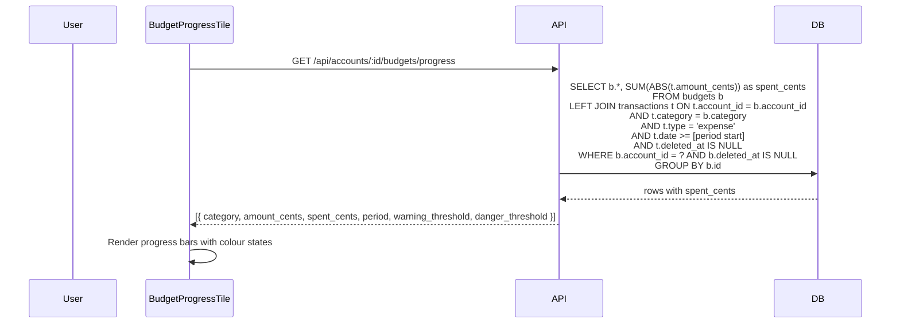
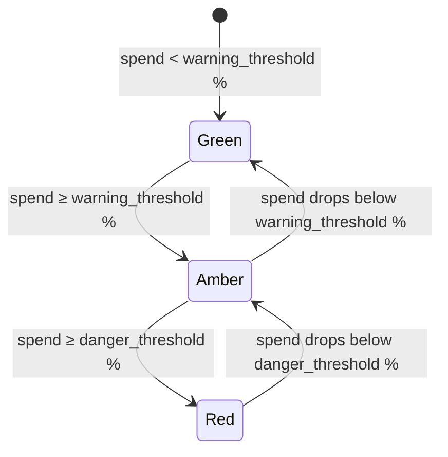

# Budget Limits Per Category

## Summary

OpenSid currently tracks spending by category but provides no feedback on whether spending is on track. This feature adds per-account, per-category budget limits with configurable warning and danger thresholds. A new Settings section allows users to create, edit, and delete budgets. A new dashboard tile displays each budget as a progress bar showing spend vs. limit for the current period, with colour-coded warnings as limits are approached or exceeded.

## Requirements

- New `budgets` table: `account_id`, `category`, `amount_cents`, `period` (monthly / weekly), `warning_threshold` (%), `danger_threshold` (%)
- Budget management UI in Settings (create, edit, delete)
- Dashboard tile showing each category's spend vs. limit as a progress bar
- Visual warning when approaching or exceeding a limit (amber at warning threshold, red at danger threshold)
- Default thresholds: 80% warning, 100% danger; both configurable per budget
- Budgets included in the backup/restore flow

## Detailed description

### Schema

```sql
CREATE TABLE IF NOT EXISTS budgets (
  id                 INTEGER PRIMARY KEY AUTOINCREMENT,
  account_id         INTEGER NOT NULL REFERENCES accounts(id),
  category           TEXT NOT NULL,
  amount_cents       INTEGER NOT NULL,
  period             TEXT NOT NULL DEFAULT 'monthly' CHECK(period IN ('monthly', 'weekly')),
  warning_threshold  INTEGER NOT NULL DEFAULT 80,
  danger_threshold   INTEGER NOT NULL DEFAULT 100,
  created_at         DATETIME NOT NULL DEFAULT CURRENT_TIMESTAMP,
  deleted_at         DATETIME,
  UNIQUE(account_id, category)
);
```

Budgets are per-account: a "Groceries" budget for Account A is independent of one for Account B.

### Settings — Budgets section

A new "Budgets" section is added to the Settings page (alongside Accounts, Dashboard, and Import/Export). It is scoped to a selected account (using the same account selector pattern as the Dashboard section).

The section lists existing budgets for the selected account in a table with columns: Category, Limit, Period, Warning %, Danger %, and actions (Edit, Delete).

An "Add budget" form (or inline row) allows the user to:
- Select a category from a typeahead (populated by the existing `GET /api/categories` endpoint, filtered to the selected account's transactions)
- Enter a limit amount in dollars
- Select period: Monthly or Weekly
- Optionally override warning threshold (default 80) and danger threshold (default 100)

Edit opens the same form pre-filled. Delete shows a confirmation dialog.

### Spend calculation

The server calculates current-period spend per category at query time:

- **Monthly**: sums expenses where `date >= first day of current calendar month`
- **Weekly**: sums expenses where `date >= Monday of current calendar week`

Only `type = 'expense'` transactions are counted, scoped to the budget's `account_id` and `category`. Soft-deleted transactions are excluded.

### Dashboard tile

A new tile type `budget_progress` displays all budgets for the associated account. Unlike other chart tiles, it has no time window — each budget's period is self-contained.

Each budget is rendered as a labelled progress bar showing:
- Category name
- `$X.XX spent of $Y.YY` (formatted dollar amounts)
- Period label ("This month" / "This week")
- Percentage spent

Progress bar colour:
- **Green** — spend < warning_threshold %
- **Amber** — spend ≥ warning_threshold %
- **Red** — spend ≥ danger_threshold %

The bar can exceed 100% width visually (capped at e.g. 110% of the bar width) to indicate overspend. The percentage label is shown outside the bar when it overflows.

If an account has no budgets configured, the tile shows an empty state prompting the user to add budgets in Settings.

The tile height grows dynamically with the number of budgets (similar to `CategoryChartTile`).

### Backup/restore

The backup payload's `version` is incremented to `2`. The payload includes a new `budgets` array. Import (both merge and wipe modes) handles the `budgets` array: wipe clears and restores, merge upserts by `(account_id, category)`.

## User stories

- As a user, I want to set a monthly spending limit for a category, so that I receive a visual warning before I overspend.
- As a user, I want to configure the warning and danger thresholds per budget, so that I can choose how early I am alerted.
- As a user, I want to see a dashboard tile showing all my budget progress at a glance, so that I don't have to dig into the transaction list to check my spending.
- As a user, I want my budgets included in backup/restore, so that I don't lose my configuration if I move to a new device.

## Key decisions

| Decision | Outcome |
|----------|---------|
| Budget scope | Per-account — each account has its own set of budget limits |
| Display location | New dashboard tile type (`budget_progress`), configurable like other tiles |
| Thresholds | Configurable per budget; default warning 80%, default danger 100% |
| Period granularity | Calendar-aligned: monthly = current calendar month, weekly = current calendar week (Monday start) |
| Spend calculation | Server-side, calculated at query time from transactions matching account + category + current period |
| Categories scoped to account | The category typeahead in budget settings is filtered to categories used by that account's transactions |
| Duplicate budget prevention | `UNIQUE(account_id, category)` constraint; one budget per category per account |

## Validation

| Rule | Error message |
|------|---------------|
| `amount_cents` must be > 0 | "Limit must be greater than zero" |
| `warning_threshold` must be 1–99 | "Warning threshold must be between 1 and 99" |
| `danger_threshold` must be > `warning_threshold` and ≤ 200 | "Danger threshold must be greater than the warning threshold" |
| `category` must be non-empty | "Category is required" |
| `period` must be `monthly` or `weekly` | (enforced by select, not shown as error) |
| Duplicate category for the account | "A budget for this category already exists" |

## Diagrams





## Acceptance criteria

```gherkin
Feature: Budget limits per category

  Scenario: Create a budget in Settings
    Given I am in Settings > Budgets with an account selected
    When I fill in the category "Groceries", limit "$500", period "Monthly", and leave thresholds at defaults
    And I save the budget
    Then the budget appears in the list showing "Groceries — $500.00 / month — warn 80% / danger 100%"

  Scenario: Duplicate category is rejected
    Given a budget for "Groceries" already exists for an account
    When I try to create another budget for "Groceries" on the same account
    Then I see the error "A budget for this category already exists"

  Scenario: Edit a budget
    Given a budget for "Dining" with a $200 limit exists
    When I edit it to change the limit to $250
    Then the list shows the updated limit of $250

  Scenario: Delete a budget
    Given a budget for "Transport" exists
    When I click Delete and confirm
    Then the budget is removed from the list
    And its progress bar no longer appears on the dashboard tile

  Scenario: Dashboard tile shows progress bars
    Given an account has budgets for "Groceries" ($500/month) and "Dining" ($200/month)
    And the account has $200 of grocery expenses and $180 of dining expenses this month
    When I view the dashboard
    Then the tile shows two progress bars
    And the Groceries bar is at 40% and green
    And the Dining bar is at 90% and amber (≥ 80% warning threshold)

  Scenario: Progress bar turns red at danger threshold
    Given a budget for "Entertainment" with a $100 limit, warning 80%, danger 100%
    And $105 of entertainment expenses have been recorded this month
    When I view the dashboard tile
    Then the Entertainment bar is red and shows "105%" or similar overspend indicator

  Scenario: Weekly budget resets each week
    Given a budget for "Coffee" with a $30/week limit
    And $25 of coffee expenses were recorded last week
    And $5 of coffee expenses were recorded this week
    When I view the dashboard tile
    Then the Coffee bar shows $5 spent of $30 (17%)

  Scenario: Empty state when no budgets configured
    Given an account has no budgets
    When I add a budget_progress tile for that account
    Then the tile shows an empty state message prompting me to add budgets in Settings

  Scenario: Budgets included in backup
    Given I have budgets configured for an account
    When I export a backup
    Then the backup file includes the budgets array with all budget limits

  Scenario: Budgets restored from backup (wipe mode)
    Given I have a backup file containing budgets
    When I import it in wipe mode
    Then all previous budgets are replaced with those from the backup

  Scenario: Budgets restored from backup (merge mode)
    Given I have a backup file containing budgets for an account
    When I import it in merge mode
    Then budgets from the backup are merged; existing budgets for the same account+category are updated
```

## Manual test steps

1. Go to Settings. Confirm a "Budgets" section appears in the navigation.
2. Select an account. Confirm a form to add a budget is visible, with fields for category (typeahead), limit amount, period (Monthly/Weekly), warning %, and danger %.
3. Add a budget: category "Groceries", limit $500, Monthly, warning 80%, danger 100%. Save. Confirm it appears in the list.
4. Try adding another budget for "Groceries" on the same account. Confirm an error "A budget for this category already exists" is shown.
5. Add a second budget: category "Dining", limit $100, Monthly, warning 60%, danger 90%. Save.
6. Click Edit on the Groceries budget. Change the limit to $400. Save. Confirm the list shows $400.
7. Add a "budget_progress" tile to the dashboard for the same account (via Dashboard settings). Confirm the tile appears.
8. Confirm the tile shows progress bars for Groceries and Dining with current-month spend, formatted amounts, and green bars (assuming little spend).
9. Add expense transactions to push Groceries spend above 60% of $400 ($240+). Refresh the dashboard. Confirm the Groceries bar changes colour appropriately based on the configured thresholds.
10. Push Dining spend above 90% (> $90). Confirm the Dining bar turns red.
11. Add more Dining expense to exceed $100 (100%+). Confirm the bar visually indicates overspend.
12. Go back to Settings > Budgets. Delete the Dining budget and confirm. Reload the dashboard and confirm the Dining bar is gone.
13. Export a backup. Open the file and confirm it contains a `budgets` array with the Groceries budget.
14. Import the backup in wipe mode. Confirm budgets are restored correctly.

## Implementation tasks

1. **Add `budgets` table via migration**
   - [server/src/db.ts](server/src/db.ts) — add `CREATE TABLE IF NOT EXISTS budgets (...)` with `account_id`, `category`, `amount_cents`, `period`, `warning_threshold` (DEFAULT 80), `danger_threshold` (DEFAULT 100), `created_at`, `deleted_at`, and `UNIQUE(account_id, category)` constraint

2. **Budget repository**
   - New file: [server/src/budgets/repository.ts](server/src/budgets/repository.ts)
   - `getBudgets(accountId)` — list all non-deleted budgets for an account
   - `getBudgetProgress(accountId)` — join with transactions to compute `spent_cents` per budget for the current period; compute period start date in JS (`getMonthStart()` / `getWeekStart()` helpers returning `YYYY-MM-DD`)
   - `createBudget(accountId, data)` — insert, return created row
   - `updateBudget(id, accountId, data)` — update, scoped to account for safety
   - `softDeleteBudget(id, accountId)` — set `deleted_at`, scoped to account

3. **Budget routes**
   - New file: [server/src/budgets/routes.ts](server/src/budgets/routes.ts)
   - `GET /api/accounts/:accountId/budgets` → `getBudgets`
   - `GET /api/accounts/:accountId/budgets/progress` → `getBudgetProgress`
   - `POST /api/accounts/:accountId/budgets` → `createBudget` (validate fields per Validation section)
   - `PUT /api/accounts/:accountId/budgets/:id` → `updateBudget`
   - `DELETE /api/accounts/:accountId/budgets/:id` → `softDeleteBudget`
   - Mount in [server/src/index.ts](server/src/index.ts): `app.use('/api/accounts/:accountId/budgets', budgetRoutes)`

4. **Client API**
   - New file: [client/src/api/budgets.ts](client/src/api/budgets.ts)
   - Types: `Budget`, `BudgetProgress` (adds `spent_cents`, `percent`)
   - Functions: `getBudgets`, `getBudgetProgress`, `createBudget`, `updateBudget`, `deleteBudget`
   - Follow pattern in existing API files (axios, typed return values)

5. **Settings > Budgets section**
   - New file: [client/src/components/settings/BudgetsSection.tsx](client/src/components/settings/BudgetsSection.tsx)
   - Account selector (follow `DashboardSection.tsx` pattern)
   - Table listing budgets with Edit/Delete actions
   - Add/Edit form with: category typeahead (use existing `GET /api/categories` query), amount input, period select, warning % input (default 80), danger % input (default 100)
   - Delete uses `ConfirmDialog`
   - All mutations use `useMutation`, invalidate `['budgets', accountId]` on success
   - Register in [client/src/pages/Settings.tsx](client/src/pages/Settings.tsx): add to `navItems` and conditional render

6. **`BudgetProgressTile` component**
   - New file: [client/src/components/BudgetProgressTile.tsx](client/src/components/BudgetProgressTile.tsx)
   - Props: `accountId: number`, `accountName: string`
   - Fetch from `GET /api/accounts/:accountId/budgets/progress` using `useQuery(['budget-progress', accountId])`
   - For each budget, render: category label, `$spent of $limit (This month / This week)`, and a progress bar
   - Bar fill colour derived from `percent` vs `warning_threshold` / `danger_threshold`: green / amber / red
   - Cap bar visual width at 110% and show percentage label outside if overflowing
   - Empty state when no budgets exist
   - Dynamic height (follow `CategoryChartTile` pattern)

7. **Register `budget_progress` tile type**
   - [server/src/dashboard-config/repository.ts](server/src/dashboard-config/repository.ts) and [client/src/api/dashboardConfig.ts](client/src/api/dashboardConfig.ts) — add `'budget_progress'` to `TileType`
   - [server/src/dashboard-config/routes.ts](server/src/dashboard-config/routes.ts) — allow `'budget_progress'` in validation; this tile type does not require `time_window`
   - [client/src/pages/Dashboard.tsx](client/src/pages/Dashboard.tsx) — add branch for `tile.tile_type === 'budget_progress'` rendering `<BudgetProgressTile accountId={tile.account_id} accountName={...} />`
   - [client/src/components/settings/DashboardSection.tsx](client/src/components/settings/DashboardSection.tsx) — add "Budget Progress" option to tile type selector; suppress the time window selector for this tile type

8. **Include budgets in backup/restore**
   - [server/src/backup/types.ts](server/src/backup/types.ts) — add `BackupBudget` type and `budgets: BackupBudget[]` to `BackupPayload`; increment `version` to `2`
   - [server/src/backup/repository.ts](server/src/backup/repository.ts) — `exportBudgets()`: select all non-deleted budgets; include in export payload
   - [server/src/backup/importRoutes.ts](server/src/backup/importRoutes.ts) — handle `budgets` array in both wipe and merge modes:
     - Wipe: delete all budgets then re-insert
     - Merge: upsert by `(account_id, category)`; resolve account IDs via the account name mapping used for transactions
   - Handle missing `budgets` key gracefully for backwards compatibility with version-1 backups
