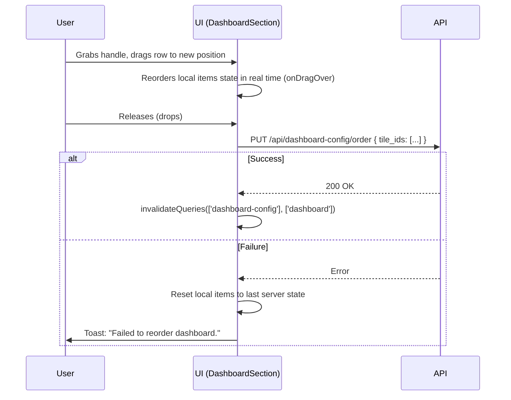

# Drag-and-Drop Reordering on Dashboard Settings

## Summary

Dashboard tiles in the Settings page can currently be reordered using up/down chevron buttons. This feature adds a grip-dots drag handle on the left side of each tile row, allowing users to reorder tiles by dragging and dropping, including on touch screens. The chevron buttons are retained for keyboard accessibility.

## Detailed description

A new leftmost column is added to the dashboard config table. Each row shows a vertical grip-dots icon (⠿) that acts as the drag handle. When a user grabs the handle and drags a row, the list reorders in real time (optimistic local update) so the user has immediate visual feedback. On drop, the new order is persisted via the existing `reorderDashboard` API call. If the API call fails, the list reverts to the last saved order and an error toast is shown.

The chevron up/down buttons remain unchanged and continue to function as before, providing keyboard-accessible reordering for users who cannot or prefer not to use drag-and-drop.

The drag handle cursor changes to `grab` on hover and `grabbing` during drag. The dragged row is visually distinguished (e.g. slightly elevated/shadowed) while in motion. The handle is not rendered when only one tile is configured, since reordering a single item is meaningless.

Touch support is required: the drag interaction must work on touch screens using touch events.

## User stories

- As a user, I want to drag a tile row to a new position on the dashboard settings page, so that I can reorder my dashboard tiles more quickly than clicking chevrons repeatedly.
- As a touch-screen user, I want to drag tiles by touch, so that I can reorder my dashboard on a tablet or phone.
- As a keyboard user, I want the chevron buttons to remain, so that I can reorder tiles without needing drag-and-drop.

## Key decisions

| Decision | Outcome |
|----------|---------|
| DnD library | Use `@dnd-kit/core` + `@dnd-kit/sortable`. Actively maintained, supports mouse and touch sensors out of the box, works with tables, and is keyboard-accessible. `react-beautiful-dnd` was ruled out as it is deprecated. |
| Handle icon | Grip dots (⠿ — a 2×3 dot grid). Universally understood as a drag handle in modern UIs. |
| Reorder timing | Optimistic local reorder during drag (real-time visual feedback). API call fires on drop. On API failure, list reverts and an error toast is shown. |
| Touch support | Required. `@dnd-kit` `TouchSensor` is enabled alongside `PointerSensor`. |
| Chevrons retained | Yes. Drag-and-drop is not inherently keyboard-accessible, so chevrons remain as the keyboard/accessibility path. |
| Single-tile case | Handle column is rendered but the handle icon is hidden (or rendered inert) when only one tile exists, since reordering is not applicable. |
| Local state during drag | A local `items` state mirrors the server config. On drag-end the local state is updated immediately and the API mutation fires. On mutation success the query is invalidated as normal. On error the local state is reset to the last server value. |

## Diagrams



## Acceptance criteria

```gherkin
Feature: Drag-and-drop reordering on dashboard settings

  Background:
    Given the user is on the Settings page
    And at least two tiles are configured on the dashboard

  Scenario: Grip handle is visible on each tile row
    Then each tile row has a grip-dots icon on its left side
    And the icon has a "grab" cursor on hover

  Scenario: Dragging a tile reorders the list in real time
    When the user drags a tile row to a new position
    Then the rows visually reorder as the drag progresses
    And the dragged row appears elevated/shadowed while in motion

  Scenario: Dropping a tile persists the new order
    When the user drops a tile at a new position
    Then the reorderDashboard API is called with the new tile ID order
    And the list reflects the new order after the API response

  Scenario: API failure reverts the order
    Given the reorderDashboard API call will fail
    When the user drops a tile at a new position
    Then the list reverts to the previous order
    And an error toast "Failed to reorder dashboard." is shown

  Scenario: Touch drag-and-drop works on touch screens
    When the user touches and holds a grip handle on a touch-screen device
    And drags it to a new position and releases
    Then the tile is reordered as expected

  Scenario: Chevron buttons still work
    When the user clicks the up or down chevron on a tile row
    Then the tile moves one position in the corresponding direction
    And the new order is persisted via the same API

  Scenario: Single tile — handle not shown
    Given only one tile is configured
    Then no grip handle is visible (or it is rendered inert)

  Scenario: Cursor changes during drag
    When the user starts dragging a row
    Then the cursor changes to "grabbing"
    When the drag ends
    Then the cursor returns to normal
```

## Manual test steps

1. Navigate to **Settings → Dashboard**.
2. Confirm at least two tiles are listed in the table.
3. Observe a grip-dots icon (⠿) on the far left of each tile row.
4. Hover over a grip icon — confirm the cursor changes to a grab hand.
5. Click and hold the grip icon on any tile row, then drag it up or down.
6. Confirm the rows visually reorder in real time as you drag.
7. Confirm the dragged row appears slightly elevated (shadow) during the drag.
8. Release (drop) the row at a new position.
9. Confirm the list shows the new order and the order is preserved on page refresh.
10. Drag a tile to a new position but simulate an API failure (e.g. disconnect network before dropping).
11. Confirm the list reverts to the original order and a toast error appears.
12. On a touch-screen device (or browser touch emulation), press-and-hold a grip handle, drag to a new position, and release — confirm the reorder works.
13. Confirm the chevron up/down buttons still reorder tiles correctly.
14. Remove all tiles except one — confirm no grip handle is shown (or it is inert).

## Implementation tasks

1. **Install DnD libraries**
   - Add `@dnd-kit/core` and `@dnd-kit/sortable` to `client/package.json`.
   - Run `npm install` in `client/`.

2. **Add local items state to `DashboardSection`**
   - In [client/src/components/settings/DashboardSection.tsx](client/src/components/settings/DashboardSection.tsx), introduce a `localConfig` state that is initialised from and synced with the `config` query result.
   - Use `localConfig` for rendering the table rows instead of `config` directly.
   - On `reorderMutation` error, reset `localConfig` back to `config`.

3. **Add `GripDotsIcon` component**
   - Add a new inline SVG icon component `GripDotsIcon` near the other icon components in [DashboardSection.tsx](client/src/components/settings/DashboardSection.tsx).
   - Use a 2×3 dot-grid path. Style with `cursor-grab` via Tailwind and `text-[var(--text-muted)]`.

4. **Add drag handle column to the table**
   - Add a new `<th>` as the first column in the `<thead>` row (narrow fixed width, no label).
   - In each `<tbody>` row, add a matching `<td>` containing the `GripDotsIcon` wrapped in the sortable drag-handle element from `@dnd-kit/sortable`.
   - Hide (or make inert) when `config.length <= 1`.

5. **Wrap the table body with `@dnd-kit` sortable context**
   - Wrap the `<tbody>` rows with `<DndContext>` (with `PointerSensor` and `TouchSensor`) and `<SortableContext>` (using the `verticalListSortingStrategy`).
   - Each `<tr>` becomes a sortable item using `useSortable({ id: item.id })`.
   - Apply `transform` and `transition` styles from `useSortable` to each `<tr>`.
   - On `onDragEnd`, call `arrayMove` (from `@dnd-kit/sortable`) to update `localConfig`, then fire `reorderMutation.mutate(newOrder.map(i => i.id))`.

6. **Style the dragged row overlay**
   - Use `DragOverlay` from `@dnd-kit/core` to render an elevated clone of the dragged row while in motion (box-shadow, slight opacity).

7. **Update tests**
   - In [client/src/components/settings/DashboardSection.test.tsx](client/src/components/settings/DashboardSection.test.tsx), add tests verifying:
     - The grip handle column is rendered when ≥ 2 tiles exist.
     - The grip handle is not rendered / is inert when only 1 tile exists.
     - Existing chevron reorder tests continue to pass unchanged.
